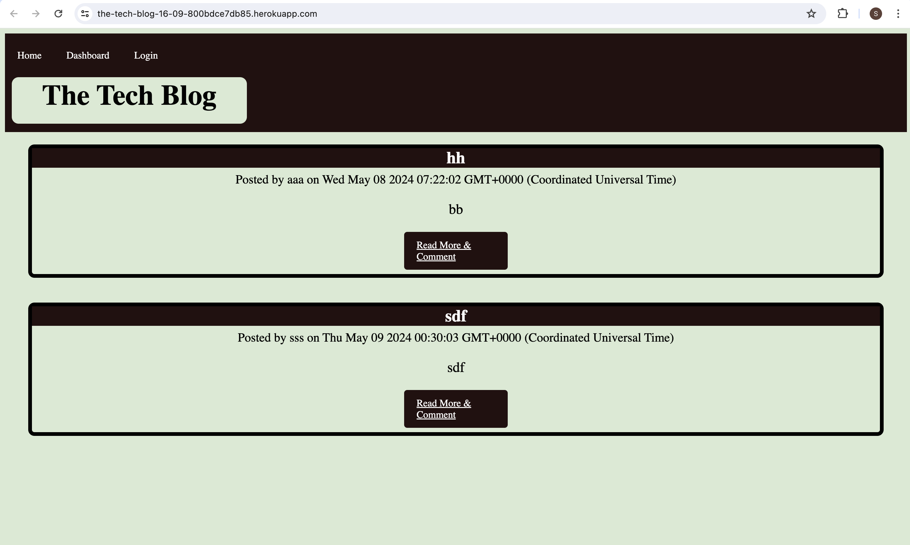

# TechBlog

## Description

TechBlog is a dynamic web application that allows users to create, edit, and delete blog posts. Users can also comment on posts, making it an interactive platform for sharing technical insights and discussions.

## Table of Contents

- [Installation](#installation)
- [Usage](#usage)
- [Features](#features)
- [Contributing](#contributing)
- [License](#license)

## Installation

To set up TechBlog locally, follow these steps:

```bash
# Clone the repository
git clone https://github.com/your_username/TechBlog.git
cd TechBlog

# Install dependencies
npm install

# Run the application
npm start
```

## Usage

After installation, navigate to `http://localhost:4000` in your web browser to start using TechBlog. You can sign up as a new user, create posts, comment on existing posts, and manage your contributions.

```bash
npm start
```

## Features

TechBlog offers a variety of features including:

- User authentication for secure login and registration.
- Creation, editing, and deletion of blog posts.
- Ability to comment on posts, as well as edit and delete comments.

## Technologies Used

- Node.js for the backend runtime environment
- Express.js for managing server-side logic and routing
- Sequelize as an ORM to interact with a MySQL database
- Handlebars.js for server-side templating
- CSS for styling the front-end components
- Heroku for cloud-based application deployment

## Repository

The code for TechBlog can be found at the following [GitHub Repository](https://github.com/StgoWF/TechBlog).

## Screenshot



## Deployment

Experience the live application [here](https://the-tech-blog-16-09-800bdce7db85.herokuapp.com/).

## Contributing
Contributions are welcome. Please fork the repository and submit a pull request with your updates.

## License
This project is licensed under the terms of the MIT license.


